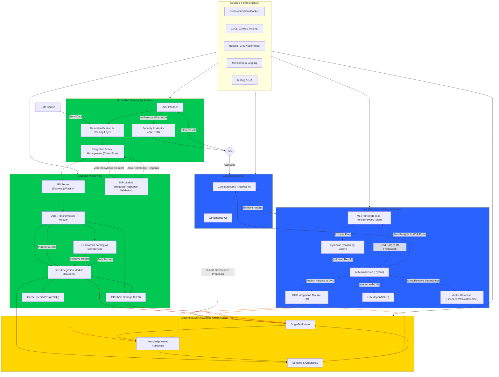

# Internet Footprint Governance and AI/ML Decentralized Application (dApp) Prototype

This application seeks to give end users complete autonomy over the data they create online through targeting devices on which users initiate data exchanges with internet based services by turning them into edge nodes in a Decentralized Knowledge Graph (DKG) network. A user facing overlay application which functions to copy data as the user goes about their online activities will communicate with a local component to retain their activity online. Client side encryption, anonymization, commodification and aggregation/analysis is the basis for networked data control system that prioritizes end users. Asynchronous processes will be in place to catalog and process the data to the DKG in a way that preserves user privacy and autonomy over the information. For analytics purposes a web based portal will be created to allow access to AI insights based on the DKG. A blockchain based reward, governance and data privacy system will be in place in the form of a DKG otherwise referred to as a paranet. Privacy and anonymization techniques like cryptographic hashes,  zero knowledge proofs and hybrid encryption will be used to store minimal user data on chain and secure data off chain decentrally in IPFS while still being able to aggregate it with others on the network for potential insights. Only users who participate in the network will be able to access the data. Additionally federated learning approaches will be explored to develop specific models and AI agents. Users will be able to access and participate in the governance of the network via the web portal. Target base for the application is internet users who want to retain control over their data, generate rewards for contributions to knowledge and gain AI based insights. This is a novel solution to privacy preserving data aggregation, analysis and community governance over information. Potential impacts include a market for data as well as analysis tools and services where the information is stored privately and in complete control of the end users. Network governance and AI insights for individual actors and businesses is an initial starting point for the network but as participation grows this system can include other actors like government entities. Enhancements can allow for effective governance and management of data resulting in community growth for analysis of the information and supply and demand for data in the network. Additionally the modular architecture of the solution will allow for further Application Specific Integrated Systems (ASIS) to be created to target specific use cases.

**Scope and Assumptions**

**In-Scope Features:** 
- User facing overlay application
    - Browser extension and desktop application to handle storage of data and interaction with the DKG. Basic information will need to be collected at time of installation to ensure data is recorded properly.

- Asynchronous process to handle the data transformation and submission to the DKG.

- Ability to opt out
    - Users need the ability to opt out on data collection based on certain criteria.

- Data management system
   - Data must be stored privatley and securely.
   - A data management system will need to be established to ensure that the system avoids taking up too much space on user devices.

- DKG and OriginTrail integration 
    - OriginTrail edge node for interaction with the DKG and offline secure data storage via IPFS. Hybrid encryption and other procedures will be built to ensure data is properly privatized and anonymized before publishing to the DKG.

- Users will need to retain TRAC tokens to publish to the DKG and will be rewarded with NEURO tokens for meaningful data contributions. 

- Applications will need to be configured to handle the proper use of TRAC as part of network costs. Users should not be directly interacting with the TRAC token.

- AI/LLM integration
    - Retrieval-Augmented Generation (RAG) workflow using symbolic AI to integrate the DKG reference data into an AI model to enforce structured reasoning and consistency. 

- Machine learning
    - ML framework will be put in place to assist with pattern recognition, adaptability and ambiguity in data sets.

- Federated learning
    - Federated learning service will be in place to be able to quickly start training dedicated AI agents.

- Dashboard for analytics insights
    - This will be a separate webpage for personalized analytics that the user can navigate to from the user facing overlay application

- Security and Identity Management
    - zkAuth user authentication system to allow web2 logins and easy management of credentials through zero knowledge proofs.

- Users must also be able to link together device identities if they are part of the same organization. This will be used to provide proper visibility into their systems in the case that multiple platforms or instances of platforms are used. 

- Governance model for ecosystem improvement
    - A governance web page for the ecosystem that allows for participants to shape the community

- DevOps and Deployment Infrastructure
    - Docker container for all services to ensure usability across a wide range of configurations.

**Out of scope (future enhancements):**
- Support for data transmission methods that run locally on device
    - Automatic detection of data communicating software.
    - This application will have an ingestion layer to allow for copying of various data inputs via whatever custom data integrations the users may have such as ODBC, XML, CSV, etc. This needs to be extremely low latency to not interfere with the speed of the system currently in place. Data must be immediately handed off to its destination and copied for further transformation. 

- Additional knowledge assets
    - MVP approach will use daily activity in terms of data exchanges as a knowledge asset. Future enhancements will provide robust analytics by including data captured outside of interactions the user has online, by other parties or sources.

- Local custom AI agent
    - A local AI agent trained and dedicated for needs defined by the network. This will likely take time to develop a federated learning service to handle this.

- Additional role support
    - Role support for other actors in the internet ecosystem will be deferred. Additional functionality and application suites can be added down the road to support other players in the ecosystem shown.

**Functional Requirements:**
- The collector application(s) must support secure login and authentication using various web2 logins.

- The identity management system must be capable of associating multiple instances of the application that are part of the same organization with each other.

- Users must provide the following data elements for initial setup
    - Role
        - Individual
        - Business
    - Business size
        - Small 
        - Medium
        - Large
    - Industry
        - Automotive
        - Retail and E-commerce
        - Energy (Oil and Gas)
        - Food and Beverage
        - Pharmaceuticals and Healthcare
        - Consumer Electronics
        - Agriculture and Commodities
        - Textiles and Apparel
        - Chemicals and Petrochemicals
        - Construction Materials
        - Mining and Natural Resources
        - Aerospace and Defense
        - Furniture and Home Goods
        - Technology and IT Equipment
        - Machinery and Equipment
- The collector application(s) must provide an organization linker that can be used to link instances of a single organization for proper data tracking. 

- The collector application must automatically detect transmission of data to and from internet based services.

- After successfully identifying that the user is sending or receiving data from internet based services the application must copy the data being sent and received.

- The collector application must be able to process and store data securely and privately

- The collector application(s) must be able to publish the agreed upon aspects of the data to the DKG in the form of a daily data exchange knowledge asset. 

- The collector application(s) must be able to display basic information on the data activity of the user. 

- The collector application(s) must have an AI microservice in place to start training dedicated AI agents via federated learning.

- The system must provide economic rewards for data contribution and participation in community governance.

- The system must have policies in place over data management to avoid data bloat in the system.

- The system must handle fees associated with publishing knowledge assets as well as fees earned with minimal user interaction. 

- The web based portal must support secure login and authentication using various web2 logins.

- A web based portal must be supported for personalized AI insights based on the shippers data and that of the network.

- The web based portal must display a breakdown of the following data types and amount on KB/MB for the user at and at the network level. Only authorized users must be able to access their own user level data. 
    - Personally Identifiable Information (PII)
    - Protected Health Information (PHI)
    - Financial Data
    - Sensitive Personal Data
    - Confidential Business Information (CBI)
    - Non-PII (Anonymized or De-Identified Data)
    - Public Information
    - Metadata
    - Behavioral Data
    - Operational Data
    - Regulatory Data
    - Derived Data
- The web based portal must allow for rewards earned from contributions to be used for advanced AI analytics.

- A web based portal for community governance where participants can help grow and shape the direction of the network.

**Non-Functional Requirements:**
- Performance of the data exchange platforms cannot be reduced in any meaningful way. Users should not be able to notice any difference in the speed at which they are able to carry out internet based activities.

- The system should be able to run on all operating systems and browsers.

- Data must be properly privatized and anonymized for aggregation and analysis purposes.

- Data cannot take up unsustainable amounts of space on user devices.

**Architectural Overview:**

The system will have a user facing application that consists of 2 parts. A browser extension for cloud based manifest systems and a lightweight application installed on the device targeting desktop systems. The 2 applications will use an identity management framework that allows users to use credentials from existing systems to authenticate and establish a presence in the network. Techniques can be used to link these credentials at an organizational level. Each application will need to have different data caching and processing mechanisms to handle the various inputs and outputs that internet based data exchange platforms could be using including databases, API’s, file submissions, etc. These will need to be minimally invasive and not disrupt normal data exchange processes or slow down operations so this integration point must be thoroughly tested to ensure it doesn’t hamper any potential configuration the customer might have. Once data has been properly cached and processed it will be stored securely using decentralized storage protocols that ensure user control over data and privacy. An AI microservice will be in place to allow participation in federated learning to train dedicated AI agents. After data is properly stored the system must publish to the blockchain using privacy preserving techniques that allow for data to be properly anonymized and aggregated for use by the entire network. Machine learning framework will be in place to detect patterns based on the data. An automated process will need to be in place for publishing to the DKG blockchain to prevent the user from having to interact with tokens. Publishing meaningful data will result in token rewards granted to the publisher. This will be handled behind the scenes and can be used on the web based framework. The base model for this architecture should be modular in terms of the data collection schemas and organizational mechanism to publish to the DKG. The result is a system that can have custom components for specific purposes. These will be referred to as Application Specific Integrated Systems (ASIS). 

The system must also include a web based dashboard to allow for AI insights on the DKG that can be personalized for the user. They will be allowed to choose AI models, write custom queries and create visualizations based on the DKG while ensuring proper data privacy concerns and met. Participants can also allocate rewards for more advanced AI analytics. The web based environment will also support an area for community governance where users can participate and drive changes in the network based on token holdings and number of edge nodes. Token rewards will also be issued for participation in community governance.

**Application Specific Integrated Systems (ASIS) Modular Architecture**
**Overview**

Application Specific Integrated Systems are software solutions designed to optimize and learn information for a specific use case. This is analogous to the hardware solution for Application Specific Integrated Circuits which use specialized hardware to optimize certain computational procedures. The modular architecture of this system allows for components to easily be modified or swapped out to target a specific use case for the system. Additionally cryptographic procedures and decentralized storage of information ensure that user data can remain private while still contributing to the ecosystem in a meaningful way.

- Objective: This architecture solves the problem of aggregating and analyzing data in a meaningful way while still upholding user privacy. 
- Key Features: 
    - A front end data collection layer with client side encryption can be modified to target data for any system the user desires.
    - Local backend to handle several data related tasks
    - Connecting to the front end securely stores and privatizes the data sufficiently before publishing to a Decentralized Knowledge Graph (DKG) network.
    - Utilizing federated learning framework to train on their local data set, using the DKG as a distributed aggregator for model changes.
    - AI/ML framework to analyze and identify patterns in the data on the network and provide specific user insights without the user having to share raw data.
    - Web portal where authenticated users can view insights on their data, the network data, as well as interact with AI agents trained for specific purposes.
    - Blockchain based Decentralized Knowledge Graph to handle data storage, governance and incentives for the community.
    - Hybrid encryption approach for access to the network. Anonymized data is encrypted with single symmetric key. Symmetric key is encrypted separately using public keys of all network participants. Each user then gets their version of an encrypted symmetric key which they can decrypt with their private key.

**Application architecture:**

**Modules**

**Front End Overlay Application**
**Module Name: Data Identification and Caching Layer**
- **Purpose:** Identify data exchanges between the user and other sources and cache information.
- **Input/Output:** Collects all raw data and outputs it into the backend.
- **Key Interfaces:** General purpose framework captures data from all online services. This can be modified to target specific APIs or data integrations.
- **Dependencies:** This module should not have any upstream dependencies due to the fact that it can be configured to handle all types of data.

**Module Name: Encryption and Key Management (client side)**
- **Purpose:** Encrypt user data using Zero Knowledge Proofs 
- **Input/Output:** Collects all raw data, encrypts it and outputs it into the backend. Services in the backend like the Federated Learning AI decrypt when necessary to train. 
- **Key Interfaces:** Data identification and Caching layer directly provides data upstream and Zero Knowledge Proof(ZKP) module interacts with it.
- **Dependencies:** Data Identification and Caching Layer as well as Zero Knowledge Proof module(ZKP)

**Backend Middleware**
**Module Name: API Server (user backend)**
- **Purpose:** Capture data from the front end system and store it in a queue for transformation and other downstream processing.
- **Input/Output:** Raw data from front end, organized raw data that can be used by the transformation module.
- **Key Interfaces:** Data Identification and Caching Layer, the API must be able to integrate with this module and change depending on the data captured. 
- **Dependencies:** Upstream dependency on the Data Identification and Caching Layer,

**Module Name: Zero Knowledge Proof Module**
- **Purpose:** Store logic for creating Zero Knowledge Proofs
- **Input/Output:** Data exchanges provided by encryption and key management module.
- **Key Interfaces:** Encryption and Key management module.
- **Dependencies:** Encryption and Key management module.

**Module Name: Data Transformation Module**
- **Purpose:** Transform data into a format that can be stored securely and privately and be used for model training purposes.
- **Input/Output:** Organized raw data from the user backend API server is fed in and transformation services structure the data for downstream storage and training purposes.
- **Key Interfaces:** User backend API Server for upstream data and interfaces for the storage and training purposes.
- **Dependencies:** User backend API server.

**Module Name: Federated Learning AI Microservice**
- **Purpose:** Train on local user dataset and communicate with the DKG integration module for model updates.
- **Input/Output:** Data from the data transformation model. Model information.
- **Key Interfaces:** Data transformation module and DKG integration module. 
- **Dependencies:** Data transformation module and DKG integration module. 

**Module Name: DKG Integration Module (user backend)**
- **Purpose:** Format the data and model changes into a knowledge asset and handle publishing to the DKG blockchain.
- **Input/Output:** Anonymized and privatized user data as well as model changes.
- **Key Interfaces:** Data transformation module for upstream data, the federated learning AI microservice, and the DKG blockchain for downstream.
- **Dependencies:** Data transformation module and federated learning AI microservice.

**Module Name: Off-chain storage (IPFS)**
- **Purpose:** Securely store user data.
- **Input/Output:** Encrypted user data
- **Key Interfaces:** Data transformation module and DKG integration module upstream, and the DKG blockchain for downstream.
- **Dependencies:** Data transformation module, DKG integration module.

**User Stories:**
- As a user, I want the ability to login to the system using my existing web2 credentials, so that I can maintain ease of use across different platforms.

- As a user, I want the system to provide an organizational linker to allow me to specify that an instance of the application is part of a specific organization.

- As a user, I want the ability to specify my role in the internet ecosystem, the size of my business, and the sector that I am a part of so I can get accurate data insights. 

- As a user, I want the ability to automatically detect data exchanges with internet based services.

- As a user I want the ability to copy the data that is being sent and received. 

- As a user I want the collector application to have the ability to display basic information on my daily activity so I can quickly view my data interactions.

- As a user I want the collector application to securely store relevant data securely and privately using a decentralized protocol, so I can prevent privacy concerns. 

- As a user I want the collector application to have a process in place to catalog and compress older data to ensure it does not take up too much space on my device.

- As a user I want the application to automatically manage the publishing of daily data exchange assets to the DKG, so the knowledge graph can grow and provide meaningful insights but I don’t have to directly interact with the tokens(used to publish transactions). 

- As a user I want the application to have an AI microservice in place to allow me to start contributing to a federated learning system for dedicated AI agents.

- As a user I want to be rewarded tokens(NEURO) for contributing data to the network.

- As a user I want the ability to opt out of data collection for certain information based on TBD criteria, so I can have flexibility over what I contribute to the network.

- As a user I want the ability to view aggregated AI insights from the DKG based on my data as well as others submitted to the network, so I can gain insights. 

- As a user I want the ability to ask free form queries about the information on the DKG so I can customize my analysis experience and examine areas that are important to me.

- As a user I want the ability to participate in community governance that drives changes to the DKG as well as the application and ecosystem itself, so I can help grow and change the network based on my needs.

- As a user I want to be rewarded tokens(NEURO) for participating in the governance of the community. 

