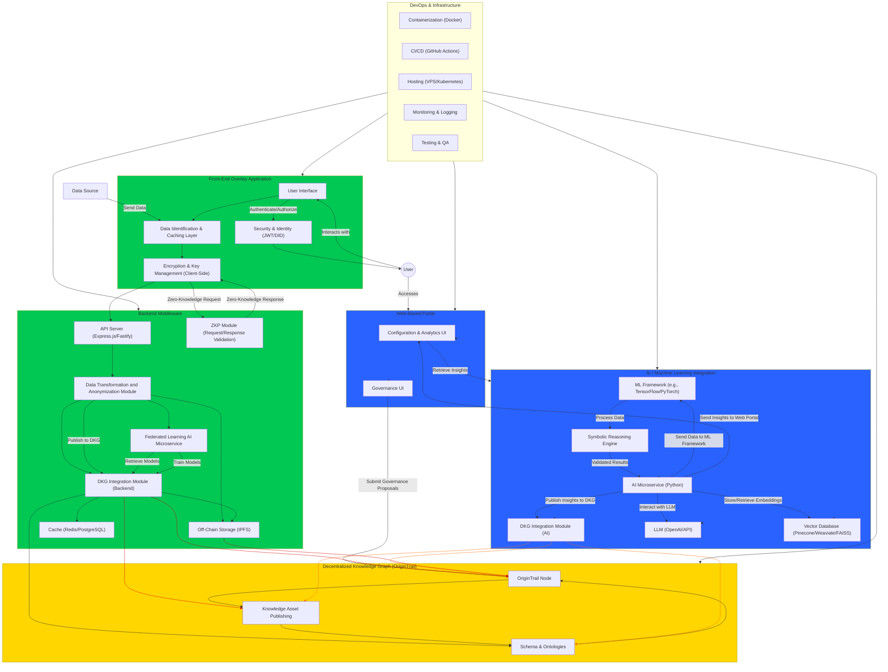

# Information Architecture
## Architectural Overview: 

The system will have a user facing application that consists of 2 parts. A browser extension for cloud based manifest systems and a lightweight application installed on the device targeting desktop systems. The 2 applications will use an identity management framework that allows users to use credentials from existing systems to authenticate and establish a presence in the network. Techniques can be used to link these credentials at an organizational level. Each application will need to have different data caching and processing mechanisms to handle the various inputs and outputs that internet based data exchange platforms could be using including databases, API’s, file submissions, etc. These will need to be minimally invasive and not disrupt normal data exchange processes or slow down operations so this integration point must be thoroughly tested to ensure it doesn’t hamper any potential configuration the customer might have. Once data has been properly cached and processed it will be stored securely using decentralized storage protocols that ensure user control over data and privacy. An AI microservice will be in place to allow participation in federated learning to train dedicated AI agents. After data is properly stored the system must publish to the blockchain using privacy preserving techniques that allow for data to be properly anonymized and aggregated for use by the entire network. Machine learning framework will be in place to detect patterns based on the data. An automated process will need to be in place for publishing to the DKG blockchain to prevent the user from having to interact with tokens. Publishing meaningful data will result in token rewards granted to the publisher. This will be handled behind the scenes and can be used on the web based framework. The base model for this architecture should be modular in terms of the data collection schemas and organizational mechanism to publish to the DKG. The result is a system that can have custom components for specific purposes. These will be referred to as Application Specific Integrated Systems (ASIS). 

The system must also include a web based dashboard to allow for AI insights on the DKG that can be personalized for the user. They will be allowed to choose AI models, write custom queries and create visualizations based on the DKG while ensuring proper data privacy concerns and met. Participants can also allocate rewards for more advanced AI analytics. The web based environment will also support an area for community governance where users can participate and drive changes in the network based on token holdings and number of edge nodes. Token rewards will also be issued for participation in community governance.

## Application Specific Integrated Systems (ASIS) Modular Architecture

Application Specific Integrated Systems are software solutions designed to optimize and learn information for a specific use case. This is analogous to the hardware solution for Application Specific Integrated Circuits which use specialized hardware to optimize certain computational procedures. The modular architecture of this system allows for components to easily be modified or swapped out to target a specific use case for the system. Additionally cryptographic procedures and decentralized storage of information ensure that user data can remain private while still contributing to the ecosystem in a meaningful way.

- **Objective:** This architecture solves the problem of aggregating and analyzing data in a meaningful way while still upholding user privacy. 
- **Key Features:** 
    - A front end data collection layer with client side encryption can be modified to target data for any system the user desires.
    - Local backend to handle several data related tasks
    - Connecting to the front end securely stores and privatizes the data sufficiently before publishing to a Decentralized Knowledge Graph (DKG) network.
    - Utilizing federated learning framework to train on their local data set, using the DKG as a distributed aggregator for model changes.
    - AI/ML framework to analyze and identify patterns in the data on the network and provide specific user insights without the user having to share raw data.
    - Web portal where authenticated users can view insights on their data, the network data, as well as interact with AI agents trained for specific purposes.
    - Blockchain based Decentralized Knowledge Graph to handle data storage, governance and incentives for the community.
    - Hybrid encryption approach for access to the network. Anonymized data is encrypted with single symmetric key. Symmetric key is encrypted separately using public keys of all network participants. Each user then gets their version of an encrypted symmetric key which they can decrypt with their private key.

## Application architecture diagram:

# Modules

## Front End Overlay Application
**Module Name: Data Identification and Caching Layer**
- **Purpose:** Identify data exchanges between the user and other sources and cache information.
- **Input/Output:** Collects all raw data and outputs it into the backend.
- **Key Interfaces:** General purpose framework captures data from all online services. This can be modified to target specific APIs or data integrations.
- **Dependencies:** This module should not have any upstream dependencies due to the fact that it can be configured to handle all types of data.

**Module Name: Encryption and Key Management (client side)**
- **Purpose:** Encrypt user data using Zero Knowledge Proofs 
- **Input/Output:** Collects all raw data, encrypts it and outputs it into the backend. Services in the backend like the Federated Learning AI decrypt when necessary to train. 
- **Key Interfaces:** Data identification and Caching layer directly provides data upstream and Zero Knowledge Proof(ZKP) module interacts with it.
- **Dependencies:** Data Identification and Caching Layer as well as Zero Knowledge Proof module(ZKP)

## Backend Middleware
**Module Name: API Server (user backend)**
- **Purpose:** Capture data from the front end system and store it in a queue for transformation and other downstream processing.
- **Input/Output:** Raw data from front end, organized raw data that can be used by the transformation module.
- **Key Interfaces:** Data Identification and Caching Layer, the API must be able to integrate with this module and change depending on the data captured. 
- **Dependencies:** Upstream dependency on the Data Identification and Caching Layer,

**Module Name: Zero Knowledge Proof Module**
- **Purpose:** Store logic for creating Zero Knowledge Proofs
- **Input/Output:** Data exchanges provided by encryption and key management module.
- **Key Interfaces:** Encryption and Key management module.
- **Dependencies:** Encryption and Key management module.

**Module Name: Data Transformation and Anonymization Module**
- **Purpose:** Transform data into a format that can be stored securely and privately and be used for model training purposes.
- **Input/Output:** Organized raw data from the user backend API server is fed in and transformation services structure the data for downstream storage and training purposes.
- **Key Interfaces:** User backend API Server for upstream data and interfaces for the storage and training purposes.
- **Dependencies:** User backend API server.

**Module Name: Federated Learning AI Microservice**
- **Purpose:** Train on local user dataset and communicate with the DKG integration module for model updates.
- **Input/Output:** Data from the data transformation model. Model information.
- **Key Interfaces:** Data transformation module and DKG integration module. 
- **Dependencies:** Data transformation module and DKG integration module. 

**Module Name: DKG Integration Module (user backend)**
- **Purpose:** Format the data and model changes into a knowledge asset and handle publishing to the DKG blockchain on a daily basis to avoid excessive transactions.
- **Input/Output:** Anonymized and privatized user data as well as model changes.
- **Key Interfaces:** Data transformation module for upstream data, the federated learning AI microservice, and the DKG blockchain for downstream.
- **Dependencies:** Data transformation module and federated learning AI microservice.

**Module Name: Off-chain storage (IPFS)**
- **Purpose:** Securely store user data.
- **Input/Output:** Encrypted user data
- **Key Interfaces:** Data transformation module and DKG integration module upstream, and the DKG blockchain for downstream.
- **Dependencies:** Data transformation module, DKG integration module.

**Module Name: Cache (Redis/PostgreSQL)**
- **Purpose:** Temporary storage and and quick efficient data access 
- **Input/Output:** 
- **Key Interfaces:** 
- **Dependencies:** 

## Decentralized Knowledge Graph (DKG) Paranet
**Module Name: Knowledge Asset Publishing**
- **Purpose:** Handle logic for publishing of knowledge assets. 
- **Input/Output:** 
- **Key Interfaces:** 
- **Dependencies:** 

**Module Name: Schema & Ontologies**
- **Purpose:** 
- **Input/Output:** 
- **Key Interfaces:** 
- **Dependencies:** 

**Module Name: Origin Trail Node**
- **Purpose:** 
- **Input/Output:** 
- **Key Interfaces:** 
- **Dependencies:** 

## AI/ML Integration
**Module Name: AI Miroservice**
- **Purpose:** 
- **Input/Output:** 
- **Key Interfaces:** 
- **Dependencies:** 

**Module Name: ML Framework**
- **Purpose:** 
- **Input/Output:** 
- **Key Interfaces:** 
- **Dependencies:** 

**Module Name: Symbolic Reasoning Engine**
- **Purpose:** 
- **Input/Output:** 
- **Key Interfaces:** 
- **Dependencies:** 

**Module Name: Vector Database**
- **Purpose:** 
- **Input/Output:** 
- **Key Interfaces:** 
- **Dependencies:** 

**Module Name: DKG Integration Module**
- **Purpose:** 
- **Input/Output:** 
- **Key Interfaces:** 
- **Dependencies:** 

**Module Name: LLM (OpenAI)**
- **Purpose:** 
- **Input/Output:** 
- **Key Interfaces:** 
- **Dependencies:** 